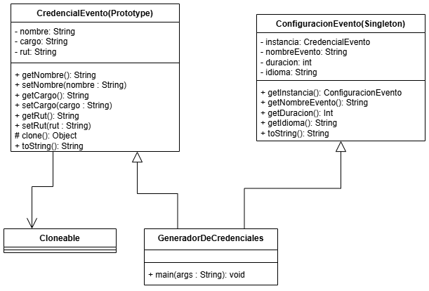
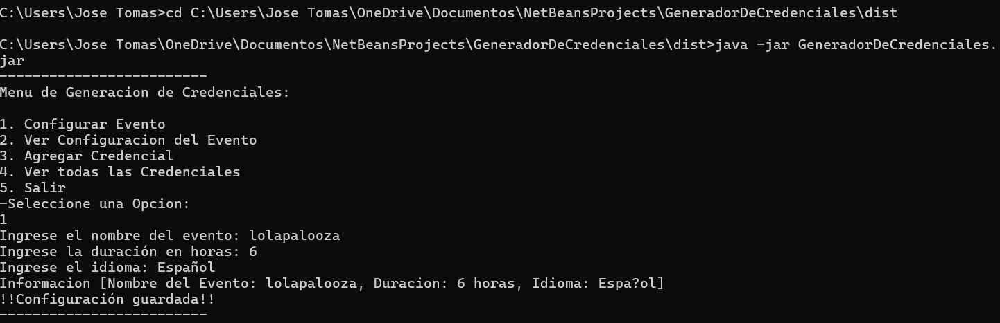
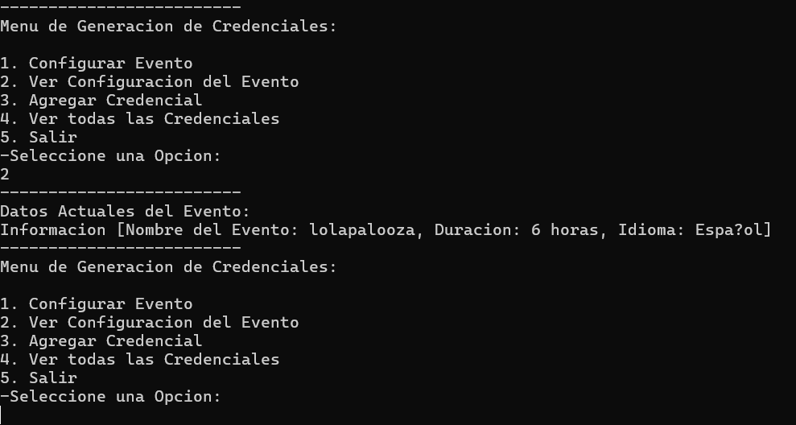
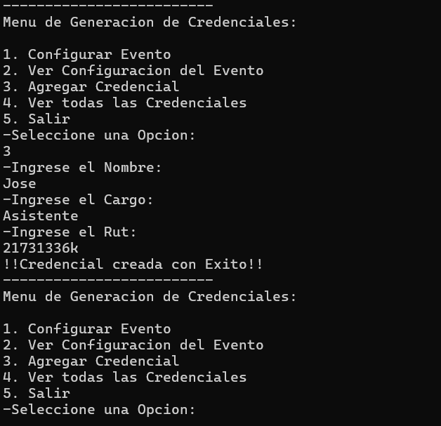
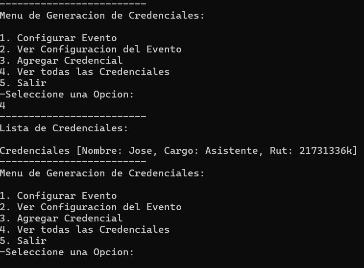
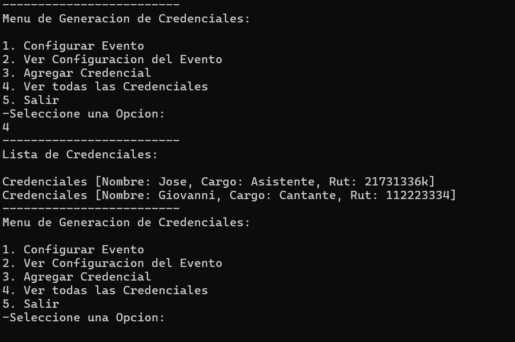
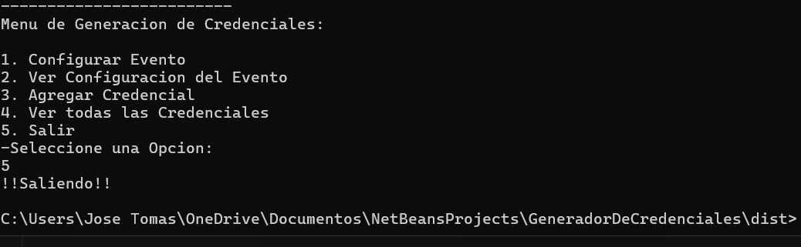

# 🪪  Generador-de-Credenciales

### Estudiante:
- Jose Cornejo - Patrones de Diseño (Seccion 2)

## 🎯 Objetivo del Proyecto

El objetivo del sistema es el permitir generar Credenciales Personlizadas para un evento a partir de un plantilla predefinida con la capaidad de ser clonada. Este sistema cuenta con clases en las cuales se aplicaron los patrones de diseño **Prototype** y **Singleton**, para clonar las credenciales y configurar el evento respectivamente.

---
## 🚀 Cómo ejecutar

en caso de tener instalado con GitBash:

1. Clonar el repositorio:
```bash

git clone https://github.com/HydraHEC/Generador-de-Credenciales.git
cd Generador-de-Credenciales
```

en caso de **NO** tener instalado GitBash:

1. Descargar desde el Repositorio:
  - En mi repositorio https://github.com/HydraHEC/Generador-de-Credenciales.git esta el archivo "GeneradorDeCredenciales.jar" disponible para su descarga

2. Compilar y ejecutar:
   
```bash
java -jar GeneradorDeCredenciales.jar
```
- si tienes **GitBash** ejecutas desde la propia CLI del programa, en caso de que NO, debes acceder a tu CMD y ejecutar el comando **CD** con la ruta donde tiene el archivo, y en esa direccion ejecutar el comando anterior:
```bash
cd ruta_del_archivo\
java -jar GeneradorDeCredenciales.jar
```

---
## 🧬 Patrón Prototype – Aplicacion
- el patron `Prototype` implementa `Cloneable` en la clase "CredencialEvento" de la siguiente forma:
  - la clase implementa la interfaz **Cloneable** y sobreescribe el metodo **clone()** de la clase Object donde, en lugar de usar **super.clone()**, crea manualmente una nueva instancia de CredencialEvento con los mismos atributos, para asi tener un mayor control sobre el proceso de clonacion y evitar una clonacion superficial
```java
public class CredencialEvento {
    private String nombre;
    private String cargo;
    private String rut;

    public CredencialEvento(String nombre, String cargo, String rut){
        this.nombre = nombre;
        this.cargo = cargo;
        this.rut = rut;
    }

    @Override
    protected Object clone() throws CloneNotSupportedException{
      return new CredencialEvento(this.nombre, this.cargo, this.rut);
    }
```
## 🔒 Patrón Singleton – Aplicación
- el patron `Singleton` en la Clase "ConfiguracionEvento" contiene un getInstancia() para generar/acceder a los datos del evento (los cuales no se pueden modificar sino hasta que se sale del sistema, debido a que el ser singleton no le permite sobreescribirse [o mi cerebro esta demasiado frito como para averiguarlo] ):
```java
    public static ConfiguracionEvento getInstancia(String nombreEvento, int duracion, String idioma){
        if(instancia==null){
            instancia = new ConfiguracionEvento(nombreEvento, duracion, idioma);
        }
        return instancia;
    }
```
## 🖥️ Menú por consola

```
-------------------------
Menu de Generacion de Credenciales:

1. Configurar Evento
2. Ver Configuracion del Evento
3. Agregar Credencial
4. Ver todas las Credenciales
5. Salir
```
## 📊 Diagrama de Clases (UML)

---

## 📸 Captura del sistema funcionando






